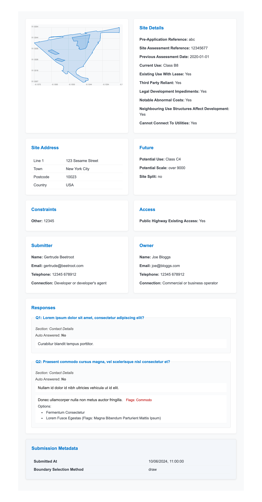

# Sites as a Service

This repository is for demonstration purposes only. It includes:

- [An example of what the site submission data standard might look like](./src/types/index.ts)
- A 'view' page showing how a user might view submitted site suggestions using a web component
- A 'form' page showing how a user might submit a site suggestion (unfinished)



## Running the project

To install dependencies:

```bash
bun install
```

To start a development server:

```bash
bun dev
```

To run for production:

```bash
bun start
```

This project was created using `bun init` in bun v1.2.23. [Bun](https://bun.com) is a fast all-in-one JavaScript runtime.
